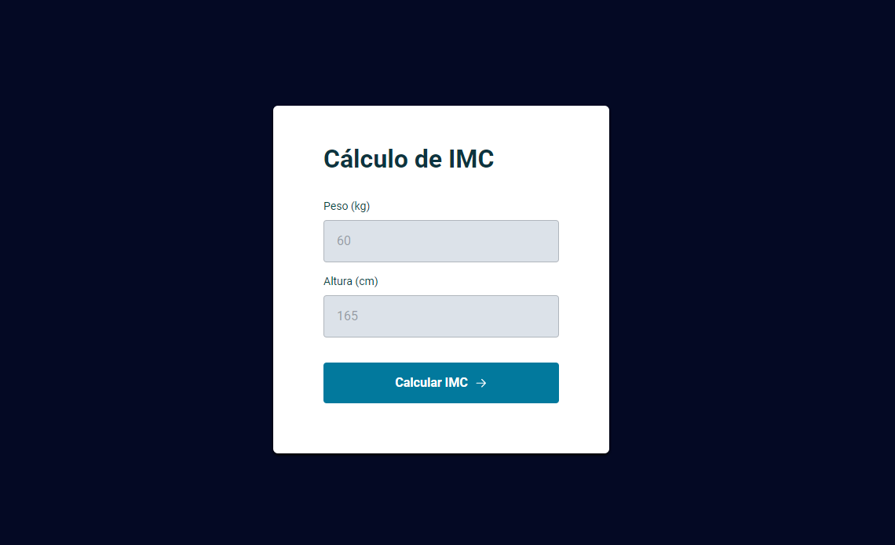

<h1 align="center">Calculadora de IMC</h1>

## 🚀 Tecnologias

Esse projeto foi desenvolvido com as seguintes tecnologias:

- HTML, CSS e JavaScript
- Git e Github

## 💻 Projeto

Você pode visualizar o projeto através [DESSE LINK](https://calculator-imc-three.vercel.app/).
